# TAJDO — Entity Relationship Diagram

## ERD (Mermaid)

```mermaid
erDiagram
    users ||--o{ addresses : has
    users ||--o{ cart_items : has
    users ||--o{ wishlists : has
    users ||--o{ orders : places
    users ||--o{ notifications : receives
    users ||--o{ complaints : files
    users ||--o{ returns : requests
    users ||--o{ reviews : writes

    categories ||--o{ products : contains

    products ||--o{ product_images : has
    products ||--o{ product_specifications : has
    products ||--o{ product_suppliers : "supplied by"
    products ||--o{ cart_items : "added to"
    products ||--o{ wishlists : "saved in"
    products ||--o{ order_items : "ordered as"
    products ||--o{ supplier_order_items : "sourced as"
    products ||--o{ reviews : receives

    orders ||--o{ order_items : contains
    orders ||--o{ order_status_history : tracks
    orders ||--o{ rescue_contributions : generates
    orders |o--o{ complaints : "related to"
    orders ||--o{ returns : "returned via"
    orders }o--o| addresses : "shipped to"
    orders |o--o{ supplier_orders : triggers

    suppliers ||--o{ product_suppliers : provides
    suppliers ||--o{ supplier_orders : receives
    suppliers ||--o{ supplier_payments : "paid via"

    supplier_orders ||--o{ supplier_order_items : contains
    supplier_orders |o--o{ supplier_payments : "paid for"

    users {
        uuid id PK
        text email UK
        text password_hash
        text full_name
        text phone
        text role
        text locale
        boolean two_fa_enabled
    }

    addresses {
        uuid id PK
        uuid user_id FK
        text label
        text line1
        text city
        text postal_code
        text country
        boolean is_default
    }

    categories {
        text id PK
        text name
        text description
        int sort_order
    }

    products {
        uuid id PK
        text sku UK
        text name
        numeric price
        numeric original_price
        text category_id FK
        text image_url
        numeric rating
        text badge
        numeric manufacturing_cost
        numeric transport_cost
        boolean in_stock
    }

    product_images {
        uuid id PK
        uuid product_id FK
        text url
        text alt_text
        int sort_order
    }

    product_specifications {
        uuid id PK
        uuid product_id FK
        text spec
    }

    wishlists {
        uuid user_id PK_FK
        uuid product_id PK_FK
    }

    cart_items {
        uuid user_id PK_FK
        uuid product_id PK_FK
        int quantity
    }

    orders {
        uuid id PK
        text order_number UK
        uuid user_id FK
        uuid shipping_address_id FK
        order_status status
        numeric subtotal
        numeric shipping_cost
        numeric tax
        numeric total
        text currency
        text payment_method
    }

    order_items {
        uuid id PK
        uuid order_id FK
        uuid product_id FK
        text product_name
        numeric unit_price
        int quantity
        numeric total
    }

    order_status_history {
        uuid id PK
        uuid order_id FK
        order_status old_status
        order_status new_status
        text note
    }

    notifications {
        uuid id PK
        uuid user_id FK
        uuid order_id FK
        text type
        text title
        text message
        boolean is_read
    }

    suppliers {
        text id PK
        text name
        supplier_type type
        text location
        text contact_email
        int default_lead_time
    }

    product_suppliers {
        uuid product_id PK_FK
        text supplier_id PK_FK
        numeric unit_cost
        boolean is_primary
    }

    supplier_orders {
        uuid id PK
        text order_number UK
        text supplier_id FK
        uuid customer_order_id FK
        supplier_order_status status
        numeric total_cost
        text tracking_number
    }

    supplier_order_items {
        uuid id PK
        uuid supplier_order_id FK
        uuid product_id FK
        text product_name
        int quantity
        numeric unit_cost
    }

    supplier_payments {
        uuid id PK
        text supplier_id FK
        uuid supplier_order_id FK
        numeric amount
        text currency
        text method
    }

    complaints {
        uuid id PK
        uuid user_id FK
        uuid order_id FK
        text subject
        text message
        complaint_status status
    }

    returns {
        uuid id PK
        uuid order_id FK
        uuid user_id FK
        text reason
        return_status status
        numeric refund_amount
    }

    reviews {
        uuid id PK
        uuid product_id FK
        uuid user_id FK
        int rating
        text title
        text body
    }

    rescue_contributions {
        uuid id PK
        uuid order_id FK
        numeric amount
        text currency
    }
```

## Table Summary

| # | Table | Purpose |
|---|-------|---------|
| 1 | users | Customer & admin accounts with 2FA and locale |
| 2 | addresses | Shipping/billing addresses per user |
| 3 | categories | Product categories (collars, leashes, etc.) |
| 4 | products | Product catalog with cost tracking |
| 5 | product_images | Multiple images per product |
| 6 | product_specifications | Product spec bullet points |
| 7 | wishlists | User saved products |
| 8 | cart_items | Shopping cart |
| 9 | orders | Customer orders with payment info |
| 10 | order_items | Line items per order (snapshot) |
| 11 | order_status_history | Audit trail of status changes |
| 12 | notifications | User notifications for order updates |
| 13 | suppliers | Alibaba & handmade supplier profiles |
| 14 | product_suppliers | Product-supplier mapping with costs |
| 15 | supplier_orders | Orders placed to suppliers |
| 16 | supplier_order_items | Line items per supplier order |
| 17 | supplier_payments | Payment records to suppliers |
| 18 | complaints | Customer complaint tracking |
| 19 | returns | Return & refund management |
| 20 | reviews | Product reviews & ratings |
| 21 | rescue_contributions | 5% philanthropic donation tracking |

## Automated Triggers

- **updated_at** — Auto-updates on users, products, orders, complaints, returns
- **order_status_log** — Records every status change in order_status_history
- **rescue_contribution** — Auto-inserts 5% donation on new orders

## Materialized Views

- **mv_daily_revenue** — Daily revenue, cost, and profit aggregation
- **mv_supplier_payment_totals** — Monthly supplier payment summaries
